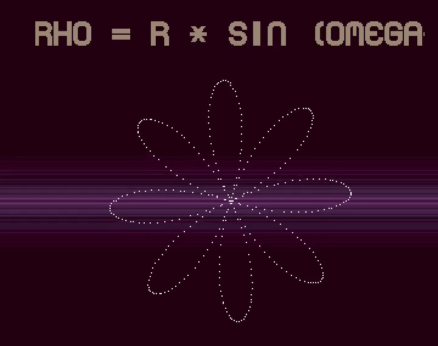

### Rodonea Amiga Demo

Ranked 4th At [flashparty 2020](http://flashparty.dx.am/) in the RETRO/ALTERNATIVE INTRO/DEMO competition.

Will run on Classic Amiga with at least 1MB of chip ram.

- Concept and coding: Alessio Garzi (Ozzyboshi)
- Mod music: Paul Kempster (Freeman / Lard Design) (https://modarchive.org/index.php?request=view_by_moduleid&query=61501)
- Suggestions and beta testing: Carlo Biondini (Z3K), Stefano Briccolani (Dr. Procton)
- Copperlist gradient : Carl Svensson
    
-------------------------------------------------------

#### Description
 Amiga demo meant for classic amigas, 1 mb of chip is mandatory. Will work on ocs/ecs and aga machines.  
 For best results use a A1200 stock.  
 The demo uses only 1 bitplane except the intro images which are 7 colors (+1 background color).  
 The project is written in C (but there are small parts in asm 68k).  
 The demo is cross-compiled with Bebbo's GCC compiler : https://github.com/bebbo/amiga-gcc and VASM (for the assember files)  
 Additionally I used ACE library for some routines https://github.com/AmigaPorts/ACE  
 Data precalculation was generated by a small utility I wrote with processing (https://processing.org/).  
 Inside the zip you can find the full source code and the assets (the vampire logo image and the precalculated rodoneas compressed with huffman algorithm).
